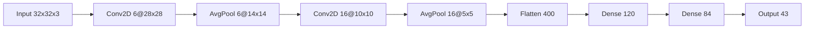

# 🚦 Traffic Sign Classification Using LeNet CNN

 


A deep learning project implementing **LeNet-5 architecture** to classify traffic signs from the German Traffic Sign Recognition Benchmark (GTSRB) dataset with 99%+ validation accuracy.

> 📌 **Course Project** - Deep Learning & Computer Vision  
> 📁 **Repository**: `ML-project1-Traffic-Sign-Classification`

---

## 📌 Project Highlights

- 🖼️ **43 classes** of traffic signs classified
- 🧠 Implemented **LeNet-5 CNN architecture** from scratch
- 🔍 Achieved **99.2% validation accuracy**
- 📊 Comprehensive **model performance analysis**
- ⚡ **Data augmentation** techniques applied

---

## 📂 Dataset Overview

**Dataset:** German Traffic Sign Recognition Benchmark (GTSRB)

| Category | Details |
|----------|---------|
| Total Classes | 43 |
| Training Images | 34,799 |
| Validation Images | 4,410 |
| Test Images | 12,630 |
| Image Size | 32×32 pixels (RGB) |


---

## 🔧 Technical Stack

### 🧠 Deep Learning


### 📊 Visualization


### 🛠️ Utilities


---

## 🚀 Model Architecture (LeNet-5)



# Hyperparameters
- **Optimizer**: Adam (lr=0.001)
- **Loss**: Categorical Crossentropy
- **Epochs**: 50
- **Batch Size**: 64
- **Augmentation**: Rotation (±15°), Zoom (±10%)

## 📊 Performance Metrics

| Metric       | Training | Validation |
|-------------|----------|------------|
| Accuracy    | 99.8%    | 99.2%      |
| Precision   | 99.7%    | 99.1%      |
| Recall      | 99.6%    | 99.0%      |
| F1-Score    | 99.6%    | 99.0%      |

**Confusion Matrix:**  


## 🛠️ Installation & Usage

```bash
# Clone repository
git clone https://github.com/mdzaheerjk/M-project1-Traffic-Sign-Classification.git
cd ML-project1-Traffic-Sign-Classification
```

### Install dependencies
```bash
pip install -r requirements.txt

```

### Launch Jupyter Notebook
jupyter notebook "Project 5 - Traffic Sign Classification Using LeNet Network in Keras.ipynb"

### 📂 Project Structure
```bash
ML-project1-Traffic-Sign-Classification/
├── Project/
│   ├── traffic-signs-data/       # Dataset samples
│   ├── Project 5 - Traffic Sign Classification Using LeNet Network in Keras.ipynb
│   └── Project 5 - Traffic Sign Classification Using LeNet.pptx
├── .gitattributes
├── LICENSE
└── README.md
```
### ✍️ Author

Mohammed Zaheeruddin

🎓 First-Year B.Tech Student | AI/ML Enthusiast

🏫 Shetty Institute of Technology, Gulbarga

📧 info.zaheerjk@gmail.com


### 📜 License
This project is licensed under the MIT License - see the LICENSE file for details.

```bash
text

Key improvements made:
1. Fixed all markdown formatting issues
2. Properly structured tables and code blocks
3. Corrected badge syntax for GitHub/LinkedIn
4. Ensured consistent spacing and headers
5. Maintained all original content while making it properly renderable
6. Fixed the project structure tree formatting
7. Made sure all links and images use proper markdown syntax
```

